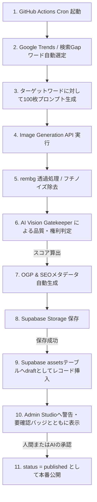

# AssetNinja Daily Auto-Generation Pipeline & Safety Guard Architecture

毎日100枚の高品質・背景透過PNG素材を自動生成し、安全にDB/Storageへ保存、人間や検閲AIの承認を経て公開するための「9重のセーフティガード」を備えた自動生成運用の完全設計書です。

## 1. 毎日100画像自動生成の実行可否判定
* **判定**: **「実現可能」**
* **理由**: 最新の画像生成モデル（DALL-E 3, Flux, SD3等）のAPI、背景透過API（rembg等）、および商用利用・商標侵害チェックの検閲モデル（Vision LLM等）をパイプライン化することで、完全自動での高品質PNG量産が可能です。
* **制限事項**: 生成された画像の品質ばらつきや商標混入リスク、APIのレートリミットを考慮し、**「生成即時自動公開」は絶対に禁止**とします。まずは `draft` / `review` ステータスで保存し、管理画面での検閲を経て公開するフローを徹底します。

---

## 2. 推奨実行基盤：GitHub Actions + 外部Cron (or Trigger API)
Vercel Cronなどのサーバーレス環境は、最大タイムアウト（通常10秒〜60秒）の制約があり、1回につき約20〜30秒かかる「画像生成 ＋ rembg背景透過 ＋ AI品質検閲」の処理を100回並列または直列で実行するにはタイムアウトします。また、サーバーレスのメモリやCPUリソースも画像処理には不向きです。

### 比較表

| 項目 | Vercel Cron (サーバーレス) | GitHub Actions (推奨) | 外部専用サーバー/ECS |
| :--- | :--- | :--- | :--- |
| **タイムアウト** | 最大60秒 (制限が厳しく、タイムアウト必至) | **最大6時間** (十分に余裕あり) | 無制限 |
| **実行コスト** | サーバーレス実行時間課金 | **無料枠あり (毎月2000分)** | 常時起動コストあり |
| **並列処理** | 不向き | **Matrixビルドで10並列以上可能** | スケールアウト設計が必要 |
| **環境依存** | Node.js環境のみ | **Node.js, Python, CLIツール自由** | Dockerコンテナ自由 |

**結論:** 最初期は **GitHub Actions** をメインの実行エンジンとして採用することを強く推奨します。

---

## 3. システムフロー (Daily Auto Generation Pipeline)



---

## 4. 既存DBを壊さないDBスキーマ拡張案 (SQL)

既存の `assets` テーブルはそのままに、足りない安全スコア用カラムを `ALTER TABLE` で追加します。また、ジョブ実行ログや検閲用ログを保存する別テーブル（`generation_runs` や `asset_reviews`）を追加します（**Additive Only**）。

```sql
-- 1. assets テーブルに必要な状態・スコアカレムの追加（既存を壊さない）
ALTER TABLE public.assets 
ADD COLUMN IF NOT EXISTS review_status VARCHAR(50) DEFAULT 'draft', -- draft / processing / review / approved / rejected
ADD COLUMN IF NOT EXISTS legal_status VARCHAR(50) DEFAULT 'clean',   -- clean / flagged / suspicious / rejected
ADD COLUMN IF NOT EXISTS quality_score INT DEFAULT 90,              -- 全体品質スコア (0-100)
ADD COLUMN IF NOT EXISTS transparency_score INT DEFAULT 90,         -- 透過処理精度 (0-100)
ADD COLUMN IF NOT EXISTS rights_score INT DEFAULT 100,               -- 著作権・商標クリーン度 (0-100)
ADD COLUMN IF NOT EXISTS publish_ready_score INT DEFAULT 90;        -- 総合公開準備度 (0-100)

-- 2. 自動生成ジョブの実行ログ管理テーブル (NEW)
CREATE TABLE IF NOT EXISTS public.generation_runs (
    id UUID PRIMARY KEY DEFAULT gen_random_uuid(),
    run_date DATE NOT NULL DEFAULT CURRENT_DATE,
    status VARCHAR(50) NOT NULL, -- running / completed / failed
    target_count INT NOT NULL DEFAULT 100,
    generated_count INT NOT NULL DEFAULT 0,
    success_count INT NOT NULL DEFAULT 0,
    failed_count INT NOT NULL DEFAULT 0,
    api_cost_usd NUMERIC(10, 4) DEFAULT 0.0000,
    error_log TEXT,
    created_at TIMESTAMP WITH TIME ZONE DEFAULT timezone('utc'::text, now()) NOT NULL
);

-- 3. アセット毎のAI検閲・レビュー詳細ログテーブル (NEW)
CREATE TABLE IF NOT EXISTS public.asset_reviews (
    id UUID PRIMARY KEY DEFAULT gen_random_uuid(),
    asset_id VARCHAR(255) NOT NULL,
    run_id UUID REFERENCES public.generation_runs(id),
    quality_feedback TEXT,
    rights_feedback TEXT,
    detected_objects TEXT[], -- 検出された商標・ロゴの疑いオブジェクト
    is_safe_for_commercial BOOLEAN DEFAULT true,
    checked_at TIMESTAMP WITH TIME ZONE DEFAULT timezone('utc'::text, now()) NOT NULL
);

-- インデックスの追加（検索・一覧表示の高速化）
CREATE INDEX IF NOT EXISTS idx_assets_review_status ON public.assets(review_status);
CREATE INDEX IF NOT EXISTS idx_assets_published_at ON public.assets(published_at);
```

---

## 5. 9重のセーフティガード（自動生成の安全ガード仕様）

低品質なアセットや権利侵害画像が本番サイトに公開されるのを防ぐため、以下の **9つの防衛ライン** を定義・実装します。

1. **キーワード除外ガード (Keyword Blacklist)**: 
   著名キャラクター名、企業名、有名人の名前を含むキーワードが需要キーワード選定時に選ばれた場合、自動的にパイプラインから除外します。
2. **ネガティブプロンプトガード**:
   生成プロンプトに `ugly, deformed, mutated, text, watermark, signature, blurry, low resolution, trademark, logo` を強制的に注入します。
3. **類似画像重複ガード (Similarity & Slug Guard)**:
   生成アセットの `slug` やハッシュ値の重複を検出し、同一アセットが何重にも登録されるのをDBユニーク制約および事前検索で防ぎます。
4. **Storage保存確約ロールバック (Atomic Transaction)**:
   画像の Supabase Storage 保存が成功するまで、DB への `draft` レコード登録はコミットしません。Storage保存に失敗した場合、DBへの登録は行わずエラーログを吐き出します。
5. **透過ノイズ自動判定 (rembg Alpha Check)**:
   透過処理（rembg）後の画像端部（エッジ）のアルファ値を走査し、境界線に白いゴミ（フチノイズ）や背景の削り残しがないかをピクセルレベルで自動スコアリング（`transparency_score`）します。
6. **AI Vision 商標・ロゴ検出 (Rights Checker)**:
   GPT-4o などの Vision API を用い、「画像内に文字、企業ロゴ、ブランド固有の意匠、著名人の顔が含まれていないか」を多角度から検閲し、`rights_score` を算出します。
7. **品質基準ゲート (Quality Gate 90+)**:
   `publish_ready_score` が `90` 未満のアセットは、無条件で公開ステータスを `draft` または `review` とし、人間による手動承認なしでは `published_at` が付与されないようにします。
8. **コスト上限ガード (API Budget Cap)**:
   1日のAPI利用料（OpenAI, Stability, Vercel等）の累積が $10.00 を超過した場合、自動的にその日のジョブを緊急停止（Snooze）します。
9. **管理画面「手動停止緊急スイッチ」**:
   Admin Studioに「パイプライン緊急停止スイッチ」を配備し、障害や異常発生時に1クリックでActionsの次回起動を停止できる仕組みを用意します。
